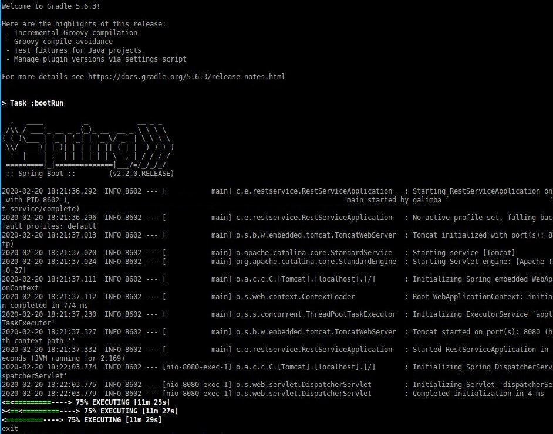
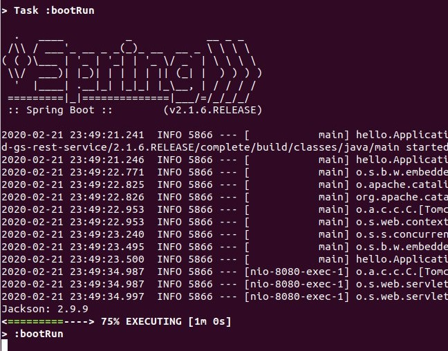

## The road 'till now and the motivation for this Jackson-deserialization-PoC:
I've been challenged to write a _Proof of Concept_ that's based on a Spring web app and exploits a _Jackson_ Deserialization vulnerability.

Since I haven't coded a single line of Java in over a decade, now... I've been reading up on the tools that I'll require. Prior to skimming the _References_, the only _Jackson_ I knew was Michael `¯\_(ツ)_/¯`
For those of you who don't know this yet:
* _Jackson_ is a Java library for handling JSON data.
* Deserialization is a common vulnerability that affects a lot of systems. It consists on malformed data or unexpected data that could be used to abuse application logic, deny service, or execute arbitrary code, when deserialized
* Spring is a java framework... more like an ecosystem that I still not fully understand. From what I've grasped so far, it's purpose is to perform some form of ORM (Object-Relational Mapping) and provide the tools to facilitate java integrations.

# My process 
## From the top:
First step: reading up on the documentation. Apparently, deserialization in _Jackson_ is similar to the one in python (pickle). I haven't coded or exploited that one but I'm familiar with the PHP one, which I believe is the most common deserialization flavor on the internet. In short, the difference here is going to be that I must code in Java and wrap everything on a spring app.
To that end, I've found two websites that should help me create a simple webapp for the PoC [1]. I think I'll be using the RESTful version, since it already responds with a JSON "hello world".
The tricky part will be to figure out a way for building the PoC around this basic webapp. I'm counting on my ability to figure out a couple of dummy classes that I'll be able to include in the project along the way... something like `class Person` or `class User`. _The idea being that I will use those with the _Jackson_ methods that are vulnerable, hence the PoC_
I haven't decided what the scope is going to be: _Availability_, _Authorization_ or _Access Control_ (OWASP [2]).

I plan on updating this post as I move forward.

## Spring 101
I'm starting by installing Gradle [5], then Spring Tool Suite [3], [4], [5]. Took me a while to figure this out but.. apparently `3.9.1` was the last tool version. After versionn `4.x` they're integrated into other IDEs like Eclipse and VScode. I followed the medium article and installed the old version, but just in case I need it in the future, I added the extension to my VScode.
After firing up STS 3.9.1, I loaded up the RESTful app tutorial. A LOT of files were imported! Gradle files, Policy files, Catalina_something files(?) Who the heck is Catalina? It's gonna take me some time to figure out what to make of all this. So... a bit of backtracking... what if I don't use STS?

I'm going to follow [1b] for creating a rest-service that answers with a Hello World. This is much more amicable, since there is a step by step explanation on how the code works, what it is expected to do and what I'm supposed to be doing. There are two main `src` folders: `initial` and `complete`. As I wish to learn, I'm going to be following the `initial` path... but if I just wanted to check out the code, I'd be taking advantage of the `complete` source code. In the end, after I've completed the walkthrough, the code should be pretty similar... but I find that typing the code myself is a different educational experience, at least that's how my brain works. You may choose either path.

One of the first things I've noticed on this tutorial, was a caption stating that `This application uses the Jackson JSON library to automatically marshal instances of type Greeting into JSON. Jackson is included by default by the web starter.` So I feel like I'm already on the right track. It's not like I'm gonna have to add many_Jackson_ functions on top of this... but I wonder if the rest of the _Jackson_ code that comes ahead is vulnerable or not. Food for thought, right now I'm somewhat occupied trying to complete the task at hand: getting my first Spring-based REST web app working. I'll deal with _Jackson_ and vulnerabilities later.

A minute goes by... and I've got my first class coded in java. It's been years, but the sitax feels like C++, which I'm really comfortable with. A simple class, two private methods, a constructor and two getters. Then things get complicated. Note to self: I've got to read up on `@RestController`, `@RequestParam` and `@GetMapping`. I can't help but wonder if a naive use of this annotations might lead to unsanitized variables. For now, back to the task at hand: I'll create the class that handles the HTTP GET requests for greetings.

Continuing with the tutorial, I learn that `Spring’s MappingJackson2HttpMessageConverter is automatically chosen to convert the Greeting instance to JSON`. this is something interesting. I might need to google this converter for vulnerabilities that are relevant to this challenge.

After a couple of minutes speed reading about Spring annotations, I'm finally ready to run the code (go to `complete/` then `./gradlew bootRun`) Gradle does the job, a Spring initialization log shows up on the terminal and I fire up my browser. `localhost:8080/greeting` responds with `{"id":1,"content":"Hello, World!"}`. Success!

Then I refresh and the id starts to climb, as it should. Trying the parameter: `localhost:8080/greeting?name=foo` gets a proper reply `{"id":4,"content":"Hello, foo!"}`

So far, so good... but for now, I've got to cut this one short. 

To be continued...

----------------------------------------------------

## Getting it right
One of the main conditions -for this PoC to work- is going to be the _Deserialization of untrusted data_ using _Jackson_. That could perfectly be achieved if I purposely code a vulnerable function. I mean:

* _step one_ : create whatever _Spring_ app
* _step two_ : make up some objects to serialize/unserialize explicitly latest _Jackson_ functions
* _step three_ : explicitly make the code vulnerable, as in this talk [13]

Technically speaking, even though I'd be developing "a _Spring_ app" that uses _Jackson_ and has a known deserialization vulnerability, the issue is the vulnerability wouldn't be on _Spring_. _Andrea Brancaleoni_ at _Doyensec_ wrote a cool brakedown for this kind of issue [11]. In fact, the fact that _Spring_ was used wouldn't be of any consequence in this scenario: I'd only be cheating myself. Since I don't think my challenger meant for me to interpret the original statement in this manner, I'm not gonna move forward with that plan.

Now, I believe the spirit of this PoC is to learn to exploit a version of _Spring_ that is not vulnerable on it's own, but because it implicitly uses a vulnerable _Jackson_ version, any app that uses it is inherinherently and indirectly exploitable. With that in mind, I've found this post [7] by _Brian Vermeer_ from exactly 6 months ago. He describes a vulnerability in _Spring Boot_ (_v2.1.7_). The vulnerability exists because that version uses an old version of `jackson-databind` (_2.9.9_). Apparently, it was quickly fixed in _Jackson v2.9.9.3_. Current release as of today is _2.10.2_ [8].

The _Spring Boot_ version I was using yesterday was _v2.2.0_, but only because that's the one I downloaded from the website to follow the guide. I can imagine how a lot of applications haven't updated their _Spring Boot_ over the past few months. Furthermore, I can picture a lot of developers not having a clue on which _Jackson_ version their _Spring_ code is relying on... and thinking _if it ain't broke, don't fix it_. Note to self: Further reading on this vulnerabilities: search the web for `CVE-2019-14379` and `CVE-2019-14439`.

So... now the plan is to attempt to use the same turorial I used yesterday, but with a rolled-back version of _Spring_. That way, I'd be properly simulating our scenario: A year old webapp that has been partially updated but still uses _Jackson v2.9.9_ [9]

But first I wanted to check which version of _Jackson_ my _Spring_ app from yesterday was using! So I added three lines of code to `RestServiceApplication.java`.
* `import com.fasterxml.jackson.core.Version;` to include the _Jackson_ Version methods.
* `Version version = com.fasterxml.jackson.databind.cfg.PackageVersion.VERSION;` to set up the `version` variable with the proper _Jackson_ version.
* `System.out.println("Jackson: "+version);` to expose the _Jackson_ version on runtime.

Then I fired up the webapp again. It's _Jackson v2.10.0_! Well, so far so good. I need to down-grade this up-to-date version of the code, for an older one. I expected the official repo would be patched at this point, and it was. I don't expect every webapp using _Spring Boot_ in the wild to be patched, though. _Note to self: write a script for crawling github / gitlab in search for this kind of vulnerabilities_

I searched for an older release within the tutorial's repo. _Spring_ has all of it's tutorial uploaded to GitHub. I found a past version [12] from past June that was based on _Spring v2.1.6_. I put it on (old-gs-rest-service) There were some older versions from March and April last year that I tested as well, but apparently they were too old and _Gradle_ had deprecated a couple of functions. I could have tried to make them work but it wasn't worth the trouble. I already had what I needed.

I introduced the same modifications to the code, just so I could debug the _Jackson_ version on the older web-app tutorial.

Finally, I have a functioning webapp with a version of _Spring_ which is less than a year old and has an indirect vulnerability due to _Jackson v2.9.9_.

----------------------------------------------------

----------------------------------------------------

----------------------------------------------------
# References and links I use

[1a] getting started: https://spring.io/guides/gs/serving-web-content/

[1b] https://spring.io/guides/gs/rest-service/

[2] https://owasp.org/www-community/vulnerabilities/Deserialization_of_untrusted_data

[3] https://spring.io/guides/gs/sts/

[4] install spring on VScode https://marketplace.visualstudio.com/items?itemName=Pivotal.vscode-boot-dev-pack

[5] https://gradle.org/install/

[6] https://youtu.be/Kd75BubLsUo?t=1418

[7] http://www.pwntester.com/blog/2013/12/16/cve-2011-2894-deserialization-spring-rce/

[8] https://github.com/FasterXML/jackson-databind

[9] https://github.com/FasterXML/jackson-databind/releases/tag/jackson-databind-2.9.9

[10] https://github.com/spring-projects/spring-boot/releases/tag/v2.2.0.M4

[11] https://blog.doyensec.com/2019/07/22/jackson-gadgets.html

[12] https://github.com/spring-guides/gs-rest-service/releases/tag/2.1.6.RELEASE

[13] https://www.youtube.com/watch?v=Kd75BubLsUo

General References:
https://github.com/no-sec-marko/java-web-vulnerabilities

https://www.owasp.org/images/d/d7/Marshaller_Deserialization_Attacks.pdf.pdf

https://github.com/FasterXML/jackson

https://www.baeldung.com/jackson-object-mapper-tutorial

https://cwe.mitre.org/data/definitions/502.html

https://dan.lousqui.fr/explaining-and-exploiting-deserialization-vulnerability-with-python-en.html

Spring tutorials:
https://www.youtube.com/watch?v=gq4S-ovWVlM

https://medium.com/@nditah/how-to-install-spring-tool-suite-3-on-ubuntu-18-30ca339a0787

consuming RESTful apps https://spring.io/guides/gs/consuming-rest/

https://spring.io/guides

https://spring.io/projects

dowload demo https://start.spring.io/

https://www.javatpoint.com/spring-tutorial

Spring serialization:
https://www.baeldung.com/spring-boot-jsoncomponent

https://snyk.io/vuln/SNYK-JAVA-ORGSPRINGFRAMEWORKSECURITY-31509

https://snyk.io/vuln/SNYK-JAVA-COMFASTERXMLJACKSONCORE-31507

https://docs.spring.io/spring-boot/docs/1.4.0.M3/reference/html/howto-spring-mvc.html

JackSON reserialization vulns:
https://medium.com/@cowtowncoder/on-jackson-cves-dont-panic-here-is-what-you-need-to-know-54cd0d6e8062

https://adamcaudill.com/2017/10/04/exploiting-jackson-rce-cve-2017-7525/

https://github.com/FasterXML/jackson-databind/issues/1599

https://nvd.nist.gov/vuln/detail/CVE-2017-7525

https://github.com/mbechler/marshalsec

MadGadget:
https://stackoverflow.com/questions/42580717/mad-gadget-de-serialisation-vulnerability-java-example

https://github.com/frohoff/ysoserial 

https://www.youtube.com/watch?v=VaLSYzEWgVE
        
https://github.com/frohoff/ysoserial/tree/master/src/main/java/ysoserial/exploit

How to prevent this:
https://github.com/kantega/notsoserial
