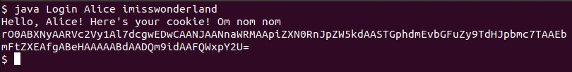
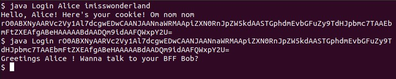
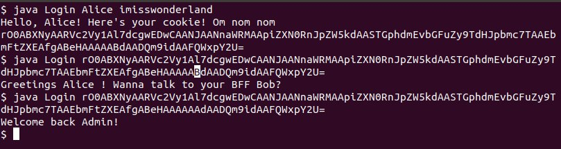

## Simpler Proof of Concept 
I'm sharing a simpler version of the deserialization vulnerability. I based this example on a very educational talk [1] by _Alexei Kojenov_. Go check that out!

We have a _User.java_ class, and a _Login.java_ command line application that makes use of it. Users may have a _group id_, a _name_ and a _best friend_.
If the `gid` is set to zero, then we the user `isRoot()`. There's also a `SuperSecretBackDoor` that "someone" coded. Even though we don't need it for this PoC, it'd be interesting if you could exploit it. Let me know in a comment or open up an Issue if you do. [Spoiler](Spoiler.md)

The `Login` class handles the application security. To compile it, run `javac Login.java`.
To run the app, a user might want to create a login cookie with their own credentials by running `java Login username password`
If they already have their session cookie, they're able to run `java Login base64usercookie` to log in.

Example:
Alice wants to talk to her best friend, Bob. She needs a cookie to log in. So first thing Alice does is get a cookie:

Then she logs in with her cookie.

# The exploit:
A bad actor might have gotten copy of the source code and realized that if they intercepted a valid cookie and changed it to reflect that the `user` had `gid` equal to zero, then they'd be recognized as `root`!
In this scenario, a single character had to be changed (`B` to `A`).

# How did this happen?
The issue here is that there is no integrity validation on the input data (the cookie) that's going to be used to create an instance of `User`. Java reads the cookie and interprets it as a valid `User`, so it passes it along. That specific Character that we switched was the `gid`. If you wanted to double-check, you'd have to base64 decode the cookie and interpret the Java Serialized Object using a hex editor.

# Back to the main repo (Deserialization vulnerability in Jackson)
Under certain circumstances, an object deserialized using _Jackson_ might exploit a similar vulnerability than this one. Let's say, instead of changing a cookie value, you change the object to reflect a call to a method that has the ability to run commands with `exec()`. That would be SO bad! Epecially if the developers use _Spring_ without knowing that underneath the surface, it's using _Jackson_ in an insecure manner.

## References
[1] https://www.youtube.com/watch?v=t-zVC-CxYjw
